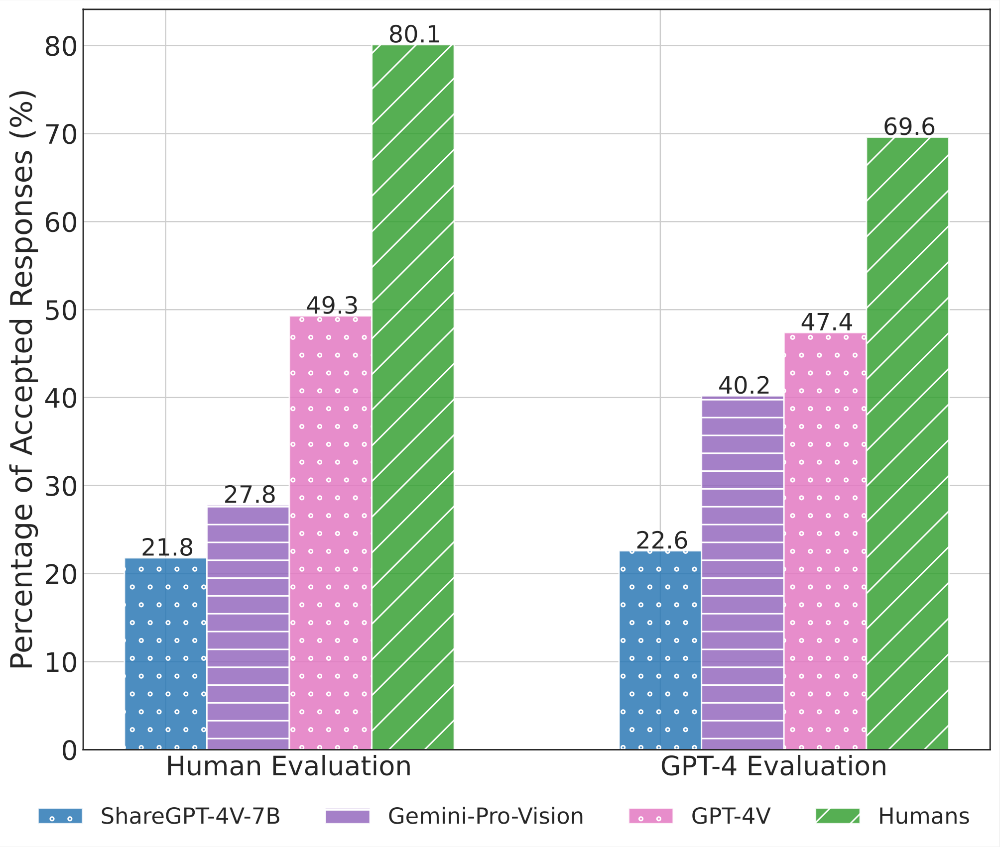
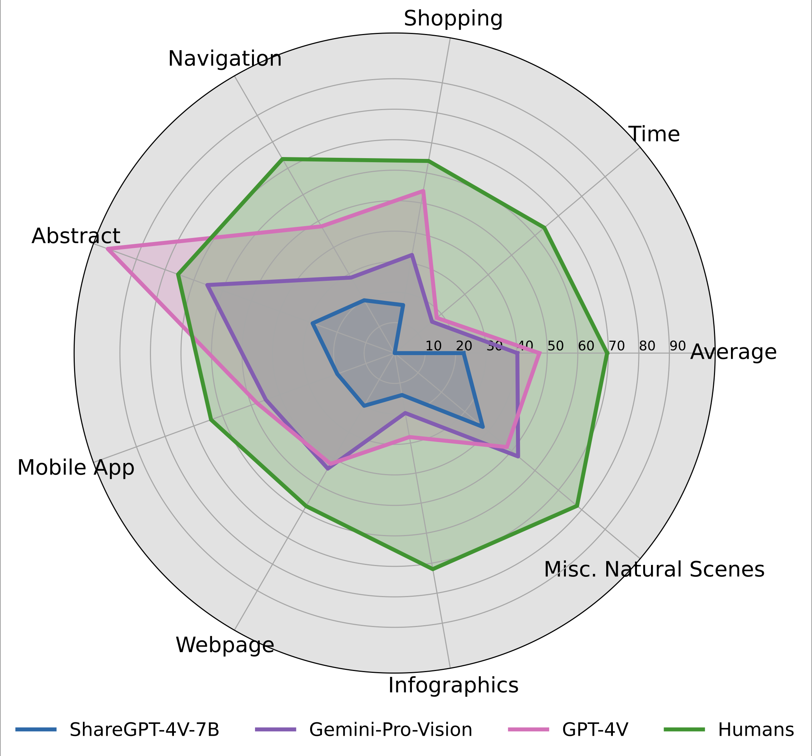
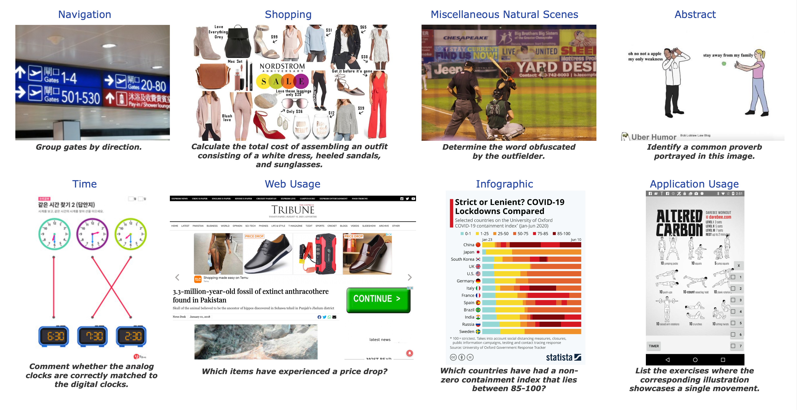
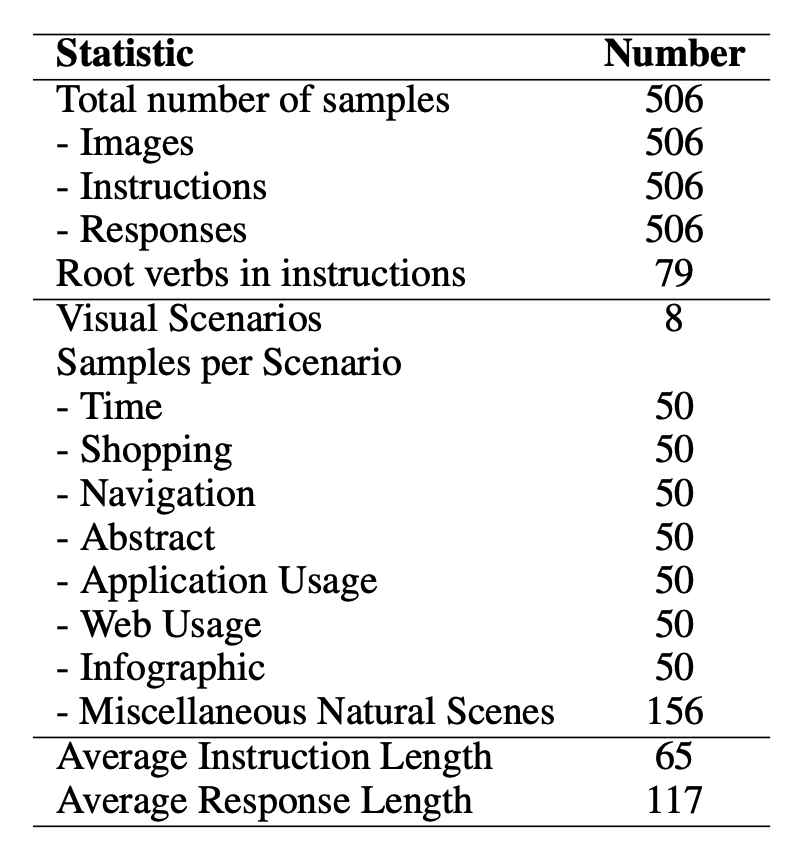
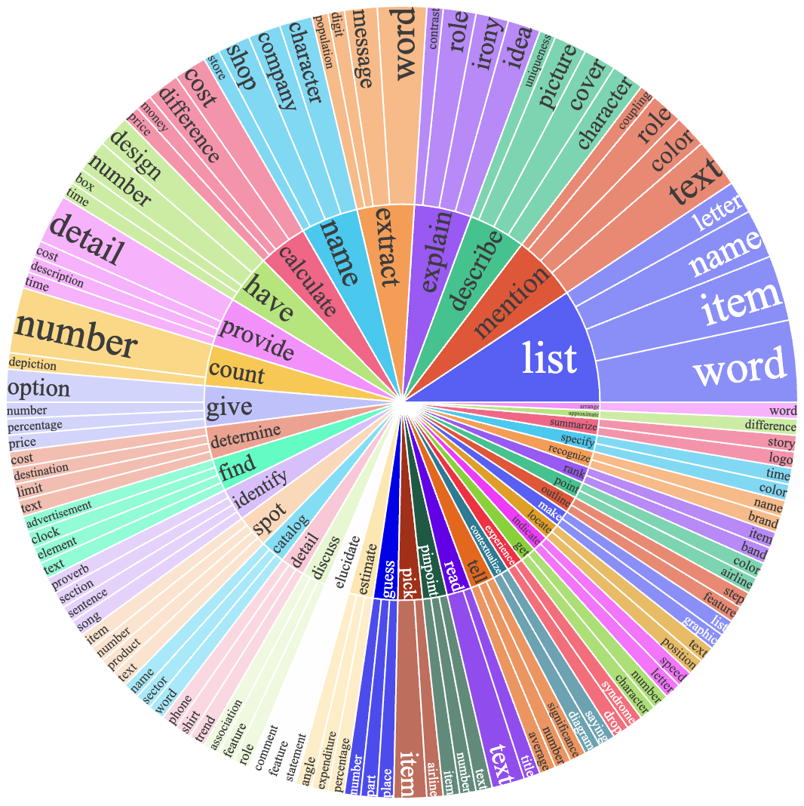

# ConTextual: Evaluating Context-Sensitive Text-Rich Visual Reasoning in Large Multimodal Models
## Accepted at ICML 2024 (Main Track), CVPR 2024 (Workshops) 🎉

 
 
 
  
 
 
 

Code for the Paper "[ConTextual: Evaluating Context-Sensitive Text-Rich Visual Reasoning in Large Multimodal Models](https://arxiv.org/abs/2401.13311)".

For more details, please refer to the project page with dataset exploration and visualization tools: [https://con-textual.github.io/](https://con-textual.github.io/).

:bell: If you have any questions or suggestions, please don't hesitate to let us know. You can comment on the [Twitter](https://twitter.com/hbXNov/status/1750576882398212363), or post an issue on this repository.

[[Webpage](https://con-textual.github.io/)] [[Paper](https://arxiv.org/abs/2401.13311)] [[Huggingface Dataset](https://huggingface.co/datasets/ucla-contextual/contextual_test)] [[Leaderboard](https://huggingface.co/spaces/ucla-contextual/contextual_leaderboard)] [[Twitter](https://twitter.com/hbXNov/status/1750576882398212363)]

<p align="center">
     <br>
  Tentative logo for <b>ConTextual</b>.
  <br>
"A visually striking logo featuring 'Con' and 'ual' in black on white, with the word 'Text' in an inverted color scheme for emphasis."
</p>

## 💥 News 💥
- **[2024.05.17]** GPT4o outshines GPT4V (prior SOTA) by 15% 😲 yet still trails humans by 7% — room for growth remains!
- **[2024.05.01]** ConTextual is accepted at [ICML 2024](https://icml.cc/virtual/2024/poster/34112)🎉
- **[2024.04.12]** ConTextual is accepted for **Oral presentation** at 3rd Vision Datasets Understanding ([VDU](https://sites.google.com/view/vdu-cvpr24/)) workshop at CVPR 2024! 
- **[2024.04.12]** ConTextual is accepted at 1st Evaluation of Generative Foundation Models ([EVGENFM](https://evgenfm.github.io/)) workshop at CVPR 2024! 
- **[2024.03.08]** [LLaVA-Next-34B](https://llava-vl.github.io/blog/2024-01-30-llava-next/) pushes the open-source LMM SOTA to 36.8👏 Less than 4% behind Gemini-Pro-Vision😮 
- **[2024.03.05]** Preliminary analysis on Claude 3 Opus. It also fails on the instances where the best performing model GPT4V fails 👀  Stay tuned for the detailed analysis! [Tweet](https://twitter.com/hbXNov/status/1765268842476077453)
- **[2024.03.05]** A [Blog](https://huggingface.co/blog/leaderboard-contextual) detailing the ConTextual dataset has been published in collaboration with HuggingFace. Thank you [Clementine Fourrier](https://twitter.com/clefourrier/status/1765042903112446303) for the support!
- **[2024.01.24]** The Test and Val Leaderboards are now hosted on HuggingFace! You can directly submit your Val subset predictions on HuggingFace to get quick view of where your model stands [HuggingFace Leaderboard](https://huggingface.co/spaces/ucla-contextual/contextual_leaderboard)
- **[2024.01.24]** The Test and Val leaderboards are out [Leaderboard](#leaderboard)
- **[2024.01.24]** Our dataset is now accessible at [Huggingface Datasets](https://huggingface.co/datasets/ucla-contextual/contextual_test).
- **[2024.01.24]** Our work was featured by [AK](https://twitter.com/_akhaliq) on [Twitter](https://twitter.com/_akhaliq/status/1750376856472236448?s=46&t=63HdzT69-RyrToanwBKbWA). Thanks!
- **[2024.01.24]** Our paper is now accessible at [https://arxiv.org/abs/2401.13311](https://arxiv.org/abs/2401.13311).

## 👀 About ConTextual

Recent advancements in AI have led to the development of **large multimodal models (LMMs)** capable of processing complex tasks involving joint reasoning over text and visual content in the image (e.g., navigating maps in public places). This paper introduces ConTextual, a novel benchmark comprising instructions designed explicitly to evaluate LMMs' ability to perform context-sensitive text-rich visual reasoning. ConTextual emphasizes diverse real-world scenarios (e.g., time-reading, navigation, shopping and more) demanding a deeper understanding of the interactions between textual and visual elements. Our findings reveal a significant performance gap of **30.8% between the best-performing LMM, GPT-4V(ision)**, and human capabilities using human evaluation indicating substantial room for improvement in context-sensitive text-rich visual reasoning. Notably, while GPT-4V excelled in abstract categories like meme and quote interpretation, its overall performance still lagged behind humans. In addition to human evaluations, we also employed automatic evaluation metrics using GPT-4, uncovering similar trends in performance disparities. We also perform a fine-grained evaluation across diverse visual contexts and provide qualitative analysis which provides a robust framework for future advancements in the LMM design.


### Model Performance
<p>
    
    
</p>

<p>
Performance of GPT-4V, Gemini-Pro-Vision, ShareGPT-4V-7B, and Humans on <strong>ConTextual</strong> benchmark. <em>Left:</em> Human evaluation and an automatic GPT-4 based evaluation of the response correctness. <em>Right:</em> Fine-grained performance with variation in visual contexts using GPT-4 based evaluation.
</p>

### Data Samples

<p align="center">
     <br>
  A sample from each of the 8 visual scenarios in <strong>ConTextual</strong> benchmark.
</p>

### Data Statistics

<p>
    
    
</p>

<p>
Data Statistics of <strong>ConTextual</strong>. <em>Left:</em> Key stats such as the quantity of samples, images, instructions, responses, both overall and categorized, and the lengths of instructions and responses. <em>Right:</em> Top 40 Most frequently occurring verbs (inner circle) and their top 4 direct nouns (outer circle) in the instructions.
</p>

For more details, you can find our project page [here](https://con-textual.github.io/) and our paper [here](https://arxiv.org/abs/2401.13311).

<a id="leaderboard"></a>
## 🏆 Leaderboard 🏆

🚨🚨 The leaderboard is continuously being updated. To submit your results to the leaderboard, please send your model predictions for the image urls in the `data/contextual_test.csv` data to [rwadhawan7@g.ucla.edu](rwadhawan7@g.ucla.edu) and [hbansal@g.ucla.edu](hbansal@g.ucla.edu).

### Accuracy scores on the Test (Overall) dataset (506 samples):

| **#** | **Model**                     | **Method** | **Source**                                                   | **Date**   | **ALL**  | **Time** | **Shop** | **Nav** | **Abs** | **App** | **Web** | **Info** | **Misc NS** 
| ----- | ----------------------------- | ---------- | ------------------------------------------------------------ | ---------- | -------- | ------- | ------- | ------- | ------- | ------- | ------- | ------- | ------- |
| -     | **Human Performance\***       | -          | [Link](https://arxiv.org/abs/2401.13311)                    | 2024-01-24 | **69.6** | 64.0    | 64.0   | 73.5    | 75.5    | 64.0    | 58.0   | 72.0    | 78.0    |
| 1     | **GPT-4o 🥇**     | LMM 🖼️      | [Link](https://openai.com/index/hello-gpt-4o/)                     | 2024-01-24 | **62.8** | 32.0    | 70.0    | 60.0    | 98.0    | 72.0    | 62.0    | 48.0    | 64.7 |
| 2     | **Gemini-1.5-Flash-Preview-0514 🥈**     | LMM 🖼️      | [Link](https://openai.com/research/gpt-4v-system-card)                     | 2024-01-24 | **56.0** | 30.0    | 51.0    | 52.1   | 84.0    | 63.0    | 63.2    | 42.8    | 61.7 |
| 3     | **Gemini-1.5-Pro-Preview-0514  🥉**     | LMM 🖼️      | [Link](https://openai.com/research/gpt-4v-system-card)                     | 2024-01-24 | **52.4** | 24.0    | 46.9    | 39.6    | 84.0    | 45.8    | 59.2    | 43.8    | 64.0|
| 4     | **GPT-4V(ision)**     | LMM 🖼️      | [Link](https://openai.com/research/gpt-4v-system-card)                     | 2024-01-24 | **47.4** | 18.0    | 54.0    | 48.0    | 100.0    | 48.0    | 42.0    | 28.0    | 48.0 |
| 5     | **Gemini-Pro-Vision**              | LMM 🖼️      | [Link](https://arxiv.org/abs/2312.11805)                     | 2024-01-24 | **40.2** | 16.0    | 32.7    | 28.6    | 65.3    | 44.9    | 43.8    | 20.0    | 52.8    |
| 6     | **LLaVA-Next-34B**              | LMM 🖼️      | [Link](https://llava-vl.github.io/blog/2024-01-30-llava-next/)                    | 2024-01-24 | **36.8** | 10.0    | 30.6    | 36.0    | 66.0    | 36.0    | 28.0    | 12.0    | 51.3    |
| 7     | **ShareGPT-4V-7B**              | LMM 🖼️      | [Link](https://arxiv.org/abs/2311.12793)                    | 2024-01-24 | **22.6** | 0.0    | 16.0    | 20.0    | 28.6    | 20.0    | 20.0    | 14.0    | 37.7    |
| 8     | **GPT-4 w/ Layout-aware OCR + Caption**                | LLM 👓      | [Link](https://arxiv.org/abs/2303.08774) | 2024-01-24 | **22.2** | 6.0    | 16.0    | 24.0    | 57.1    | 14.0    | 18.0    | 8.0    | 27.3    | 
| 9     | **Qwen-VL**               | LMM 🖼️      | [Link](https://arxiv.org/abs/2308.12966) | 2024-01-24 | **21.8** | 4.0    | 20.0    | 24.0    | 53.1    | 6.0    | 18.0    | 14.0    | 27.3    | 
| 10     | **LLaVA-1.5B-13B**           | LMM 🖼️      | [Link](https://arxiv.org/abs/2310.03744)                     | 2024-01-24 | **20.8** | 4.0    | 10.0    | 18.0    | 44.9    | 16.0    | 26.0    | 4.0    | 29.7    |
| 11     | **mPLUG-Owl-v2-7B**   | LMM 🖼️    | [Link](https://arxiv.org/abs/2311.04257)                     | 2024-01-24 | **18.6** | 4.0    | 8.0    | 24.0    | 32.7    | 20.0    | 10.0    | 12.0    | 26.0    | 
| 12     | **GPT-4 w/ Layout-aware OCR**  | LLM 👓    | [Link](https://arxiv.org/abs/2303.08774)                     | 2024-01-24 | **18.2** | 8.0    | 20.0    | 18.0    | 34.7    | 10.0    | 16.0    | 16.0    | 20.7    | 
| 13    | **GPT-4 w/ OCR**    | LLM 👓     | [Link](https://arxiv.org/abs/2303.08774)                     | 2024-01-24 | **15.9** | 4.0    | 10.0    | 14.0    | 30.6    | 8.0    | 16.0    | 28.6    | 16.9    | 
| 14    | **LLaVAR-13B** | LMM 🖼️      | [Link](https://arxiv.org/abs/2306.17107)                     | 2024-01-24 | **14.9** | 10.0    | 16.0    | 6.0    | 44.9    | 8.0    | 10.0   | 6.0    | 16.7    | 
| 15    | **BLIVA**             | LMM 🖼️      | [Link](https://arxiv.org/abs/2308.09936)                     | 2024-01-24 | **10.3** | 2.0    | 4.0    | 14.0   | 24.5    | 4.0    | 8.0   | 4.0    | 14.7    |
| 16    | **InstructBLIP-Vicuna-7B**               | LMM 🖼️      | [Link](https://arxiv.org/abs/2305.06500) | 2024-01-24 | **9.7** | 2.0    | 4.0     | 16.0    | 20.0    | 6.0    | 12.0    | 2.1    | 12.0    | 
| 17    | **Idefics-9B**             | LMM 🖼️      | [Link](https://huggingface.co/blog/idefics)                     | 2024-01-24 | **7.7** | 4.0    | 2.0    | 12.0    | 12.0    | 0.0    | 6.0    | 2.0    | 13.3    | 

### Accuracy scores on the Val subset (100 samples):

| **#** | **Model**                     | **Method** | **Source**                                                   | **Date**   | **ALL**  | **Time** | **Shop** | **Nav** | **Abs** | **App** | **Web** | **Info** | **Misc NS** 
| ----- | ----------------------------- | ---------- | ------------------------------------------------------------ | ---------- | -------- | ------- | ------- | ------- | ------- | ------- | ------- | ------- | ------- |
| -     | **Human Performance\***       | -          | [Link](https://arxiv.org/abs/2401.13311)                    | 2024-01-24 | **72.0** | 90.0    | 90.0   | 70.0    | 70.0    | 60.0    | 50.0   | 80.0    | 70.0    |
| 1     | **GPT-4V(ision) 🥇**     | LMM 🖼️      | [Link](https://openai.com/research/gpt-4v-system-card)                     | 2024-01-24 | **53.0** | 40.0    | 60.0    | 50.0    | 100.0    | 50.0    | 30.0    | 30.0    | 56.7 |
| 2     | **Gemini-Pro-Vision 🥈**              | LMM 🖼️      | [Link](https://arxiv.org/abs/2312.11805)                     | 2024-01-24 | **37.8** | 20.0    | 30.0    | 10.0   | 80.0    | 44.4    | 30.0    | 20.0    | 46.7    |
| 3     | **GPT-4 w/ Layout-aware OCR + Caption🥉**                | LLM 👓      | [Link](https://arxiv.org/abs/2303.08774) | 2024-01-24 | **23.0** | 10.0    | 10.0     | 40.0    | 60.0    | 0.0    | 10.0    | 20.0    | 26.7     |
| 4     | **ShareGPT-4V-7B**              | LMM 🖼️      | [Link](https://arxiv.org/abs/2311.12793)                   | 2024-01-24 | **17.0** | 0.0    | 30.0    | 10.0    | 30.0    | 10.0    | 10.0    | 0.0    | 26.7    |
| 5     | **LLaVA-1.5B-13B**           | LMM 🖼️      | [Link](https://arxiv.org/abs/2310.03744)                     | 2024-01-24 | **16.0** | 0.0    | 10.0    | 10.0    | 50.0    | 10.0    | 20.0    | 10.0    | 16.7    |

Some notations in the table:

- **Human Performance\*:** Average human performance from AMT annotators.

- **GPT-4V**: Open-AI's LMM GPT-4V(ision)

- **Gemini-Pro-Vision**: Google's LMM Gemini-Pro-Vision

- **GPT-4**: GPT-4 Turbo

- **Method types**
  -  **LMM 🖼️:** Large Multimodal Model
  -  **LLM 👓:** Augmented Large Language Model
  
- **Visual Scenarios:** 
  - **Time:** Time
  - **Shop:** Shopping
  - **Nav:** Navigation
  - **Abs:** Abstract
  - **App:** Application Usage
  - **Web:** Web Usage
  - **Info:** Infographic
  - **Misc NS:** Miscellaneous Natural Scenes

## 📖 Dataset Usage

All the data samoples are included in the *Test* set and we provide 100 samples as part of the *Val* to quickly prototype your model on ConTextual.

- **Test**: 506 samples used to test the models performance on ConTextual, only consists of Image and Instruction pairs. *Note 100 samples out of 506 samples are provided as Val subset.*

- **Val**: 100 samples used for model development and validation. Consists of Image, Instruction, Response triplets. 

### Data Access
- You can access the dataset on 🤗 **HuggingFace**:
  - **Test**: [Test link](https://huggingface.co/datasets/ucla-contextual/contextual_test)
  - **Val**: [Val subset link](https://huggingface.co/datasets/ucla-contextual/contextual_val)

- For ease of access and response analysis, the dataset is also available in the repository.
  - **Test**: `data/contextual_test.csv` 
  - **Val**: `data/contextual_val.csv` 

### Data Format

The dataset is provided in json format and contains the following attributes:

```
{
    "image_url": [string] url to the hosted image,
    "instruction" [string] instruction text,
    "response": [string] response text (only provided for samples in the val subset),
    "category": visual scenario this example belongs to like 'time' and 'shopping' out of 8 possible scenarios in ConTextual
}
```

## 🤖 Model Predictions

### GPT-4-Vision-Preview

- **(Step 1)** Run the following command to generate (or update) `master.json` with `GPT-4V` results.
```python
OPENAI_API_KEY=<YOUR OPENAI API KEY> python models/gpt4v/eval_gpt4v.py --data-file <location to data.csv> [data/contextual_val.csv or data/contextual_all.csv]
```

### Gemini-Pro-Vision

- **(Step 1)** First authorize with `gcloud` using `gcloud auth application-default login`. 
- **(Step 2)** Run the following command to generate (or update) `master.json` with `gemini-pro-vision` results.
```python
python models/gemini-pro-vision/eval_gemini.py --image-file <location to data.csv>[data/contextual_val.csv or data/contextual_test.csv]
```


### Open Models

We use the default settings from the respective project repos.

## 🔮 Evaluation Pipeline (GPT-4)

- **(Step 1)** Run the following command to generate `gpt4_judgments.json` containing all the gpt-4 judgements.
```python
OPENAI_API_KEY=<YOUR OPENAI KEY> python eval/response_eval_gpt4.py --data-file data/contextual_val.csv[file with responses] --master master.json --model-name <model name in master.json>
```

### Analyze Results (optional)

- **(Step 1)** Run the following command to print the average acceptance rating along with visual context specific rating and generate a `gpt_4_model_analysis.json` file.
```python
python analysis/analyze_performance.py --data-file data/contextual_val.csv[file with responses] --judgment-file gpt4_judgments.json --model-name <model name in master.json>
```

## 🤝 Contributors

Here are the key contributors to this project:

[Rohan Wadhawan](https://web.cs.ucla.edu/~rwadhawan7/)<sup>1</sup><sup> * </sup>, [Hritik Bansal](https://sites.google.com/view/hbansal)<sup>1</sup><sup> * </sup>, [Kai-Wei Chang](http://web.cs.ucla.edu/~kwchang/)<sup>1</sup>, [Nanyun Peng](https://vnpeng.net/)<sup>1</sup>

<sup>1</sup>University of California, Los Angeles, <sup>*</sup>Equal Contribution

## :white_check_mark: Cite

If you find **ConTextual** useful for your your research and applications, please kindly cite using this BibTeX:

```latex
@misc{wadhawan2024contextual,
  title={ConTextual: Evaluating Context-Sensitive Text-Rich Visual Reasoning in Large Multimodal Models}, 
  author={Rohan Wadhawan and Hritik Bansal and Kai-Wei Chang and Nanyun Peng},
  year={2024},
  eprint={2401.13311},
  archivePrefix={arXiv},
  primaryClass={cs.CV}
}
```
